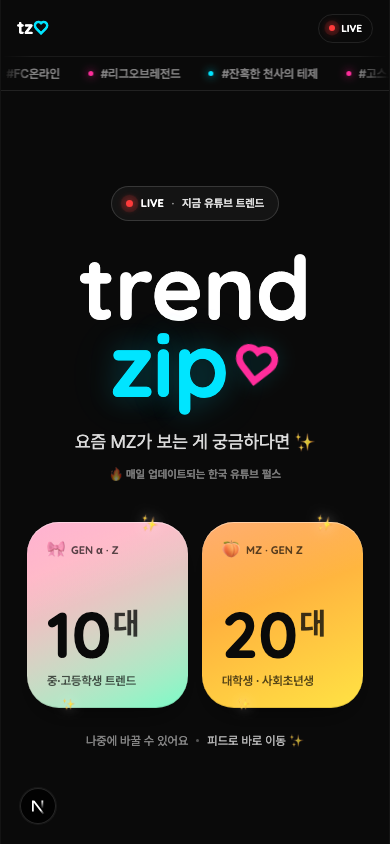
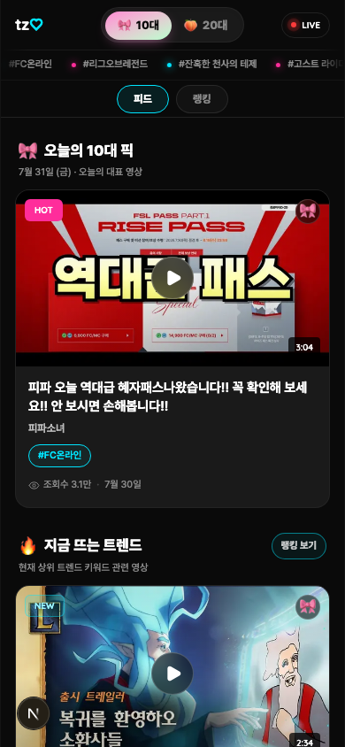
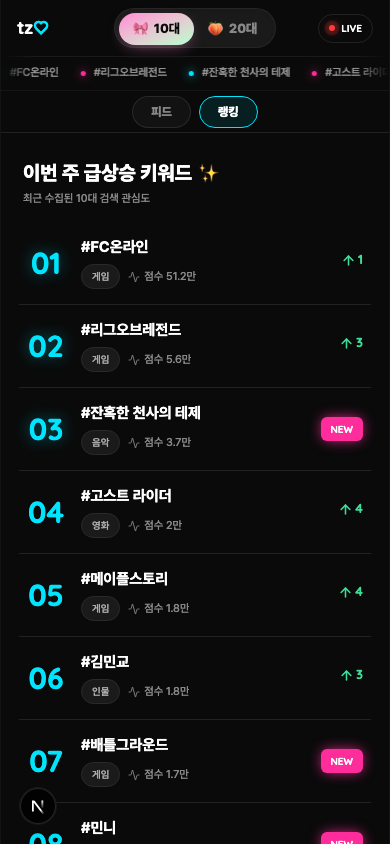
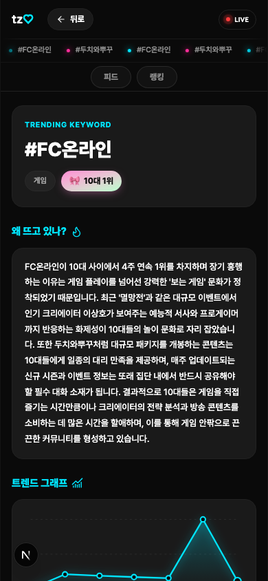
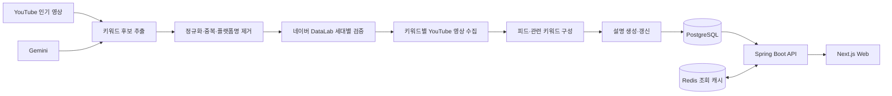
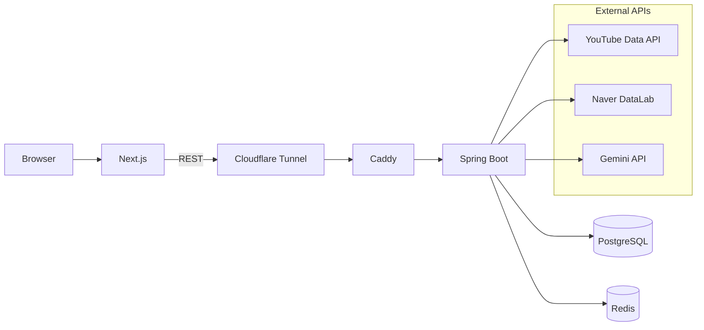

# Trendzip

> 10대와 20대가 지금 무엇을 보고 검색하는지, 30~40대 사용자가 빠르게 이해할 수 있도록 정리하는 YouTube 트렌드 웹앱

[](https://github.com/nadoran78/trendzip/actions/workflows/ci.yml)


Trendzip의 서비스명은 **MZ 따라잡기**입니다. 한국 YouTube 인기 영상에서 키워드 후보를 찾고, 세대별 검색 관심도를 검증한 뒤 각 키워드가 왜 주목받는지 설명합니다. 사용자는 로그인 없이 10대 또는 20대 피드, 키워드 순위와 상세 분석을 탐색할 수 있습니다.

- Frontend: 배포 준비 중

## Screens

<table>
  <tr>
    <th>세대 선택</th>
    <th>세대별 피드</th>
  </tr>
  <tr>
    <td></td>
    <td></td>
  </tr>
  <tr>
    <th>트렌드 랭킹</th>
    <th>키워드 상세</th>
  </tr>
  <tr>
    <td></td>
    <td></td>
  </tr>
</table>

## Key Features

- **세대별 트렌드 피드**: 10대와 20대 데이터를 분리해 오늘의 픽, 지금 뜨는 트렌드와 관련 영상을 제공합니다.
- **키워드 랭킹**: 최신 수집 결과를 기준으로 순위, 점수, 신규 진입과 순위 변동을 보여줍니다.
- **왜 뜨는지 설명**: 근거가 되는 YouTube 영상과 과거 순위를 바탕으로 Gemini가 생성한 설명을 제공합니다.
- **트렌드 그래프**: 날짜별 검색 관심도와 당시 순위를 데스크톱 호버, 모바일 탭과 키보드로 확인할 수 있습니다.
- **관련 콘텐츠 탐색**: 키워드와 연결된 영상 및 함께 살펴볼 키워드로 이동할 수 있습니다.
- **자동 수집**: 스케줄러가 외부 API 수집, 점수 산정, 설명 생성, 피드 교체와 캐시 무효화를 수행합니다.

## Data Pipeline



TEEN과 TWENTY는 같은 후보 집합에서 시작하지만 검색 점수, 순위, 설명과 피드는 서로 독립적으로 저장합니다. 수집 실패나 빈 결과가 기존 정상 피드를 지우지 않도록 크롤링 실행 상태와 활성 피드를 별도로 관리합니다.

## Architecture



백엔드, PostgreSQL과 Redis는 Mac mini의 Docker Compose에서 프로젝트 단위로 실행됩니다. Cloudflare Tunnel과 Caddy가 공개 API 요청을 백엔드 컨테이너로 전달하며, 백엔드 Docker 이미지는 GHCR을 통해 배포합니다. 프론트엔드 공개 배포는 준비 중입니다.

## Tech Stack

| Area | Technologies |
|---|---|
| Frontend | Next.js 16.2, React 19.2, TypeScript 5.9, Tailwind CSS 4.3 |
| Backend | Kotlin 2.2, Spring Boot 3.5, Java 17 |
| Persistence | Spring Data JPA, jOOQ, Flyway |
| Data | PostgreSQL 16, Redis 7 |
| External API | YouTube Data API v3, Naver DataLab, Gemini 3.1 Flash-Lite |
| Infra | Docker Compose, GHCR, Cloudflare Tunnel, Caddy, Mac mini |
| Quality | Gradle Test, ktlint, ESLint, TypeScript, Gitleaks, GitHub Actions |

## Repository Structure

```text
trendzip/
├── .github/workflows/       # CI workflow
├── backend/                 # Kotlin + Spring Boot API and scheduler
├── frontend/                # Next.js App Router web application
├── docker/                  # Local PostgreSQL initialization
├── infra/                   # Shared Mac mini reverse proxy configuration
├── design/                  # Confirmed screen designs
├── docs/                    # Business, status, convention and operations docs
├── dev/                     # Context, verification and secret scan commands
├── scripts/ops/             # Backend image build and manual deployment
├── docker-compose.yml       # Local PostgreSQL and Redis
└── docker-compose.prod.yml  # Production backend stack
```

## Local Development

### Prerequisites

- JDK 17
- Node.js 24
- Docker with Compose v2

### 1. Start dependencies

```bash
docker compose up -d
```

PostgreSQL은 `localhost:5432`, Redis는 `localhost:6379`에서 실행됩니다. 루트 Compose의 기본 자격증명은 로컬 개발 전용입니다.

### 2. Run backend

```bash
cd backend
SPRING_PROFILES_ACTIVE=local ./gradlew bootRun
```

로컬 프로필은 기본적으로 크롤링 스케줄러와 실제 외부 API 호출을 비활성화합니다. `backend/.env.example`은 사용 가능한 변수의 참고 파일이며 Spring Boot가 자동으로 읽지 않습니다. 실제 수집을 테스트할 때만 필요한 API 키와 실행 옵션을 셸 또는 IDE 실행 환경에 명시적으로 설정합니다.

### 3. Run frontend

```bash
cd frontend
npm ci
cp .env.example .env.local
npm run dev
```

- Frontend: [http://localhost:3000](http://localhost:3000)
- Backend: [http://localhost:8080/api/health](http://localhost:8080/api/health)
- Swagger UI: [http://localhost:8080/swagger-ui/index.html](http://localhost:8080/swagger-ui/index.html)

## Environment Variables

실제 환경변수 파일은 Git에 커밋하지 않습니다. 전체 목록과 기본값은 다음 example 파일에서 확인할 수 있습니다.

- Backend local: [`backend/.env.example`](backend/.env.example)
- Backend production: [`backend/.env.prod.example`](backend/.env.prod.example)
- Frontend: [`frontend/.env.example`](frontend/.env.example)

주요 외부 연동 값은 다음과 같습니다.

```env
YOUTUBE_API_KEY=
NAVER_CLIENT_ID=
NAVER_CLIENT_SECRET=
GEMINI_API_KEY=
POSTGRES_URL=
POSTGRES_USERNAME=
POSTGRES_PASSWORD=
REDIS_URL=
API_BASE_URL=
```

## API

모든 API는 `success`, `data`, `error` 필드를 가진 공통 응답 wrapper를 사용합니다.

| Method | Endpoint | Description |
|---|---|---|
| `GET` | `/api/health` | 서비스 상태 확인 |
| `GET` | `/api/feed?generation=TEEN` | 세대별 활성 피드 조회 |
| `GET` | `/api/keywords?generation=TEEN` | 세대별 키워드 순위 조회 |
| `GET` | `/api/keywords/{id}/explain` | 설명, 추이, 관련 영상과 키워드 조회 |

- Swagger UI: `/swagger-ui/index.html`
- OpenAPI JSON: `/v3/api-docs`

## Verification

DB 없이 문서, diff, backend ktlint와 frontend lint·타입을 빠르게 검사합니다.

```bash
./dev/verify
```

PostgreSQL, Flyway, jOOQ, backend test·build와 frontend production build를 모두 검사합니다.

```bash
./dev/verify --full
```

비밀정보는 커밋 전 staged 변경과 전체 Git 이력을 각각 검사합니다.

```bash
./dev/check-secrets --staged
./dev/check-secrets --all
```

GitHub Actions는 pull request와 `develop` push에서 Gitleaks 검사를 먼저 실행하고, 성공한 경우에만 전체 통합 검증을 진행합니다.

## Project Status

현재 랜딩, 세대별 피드, 트렌드 랭킹과 키워드 상세의 핵심 사용자 흐름이 구현되어 있습니다. 백엔드는 운영 환경에 수동 배포되어 있고 프론트엔드 공개 배포를 준비하고 있습니다.

다음 우선순위는 다음과 같습니다.

1. PWA 및 프론트엔드 배포
2. OpenAPI 기반 frontend 타입 계약 자동화
3. 핵심 사용자 흐름 E2E 테스트

세부 구현 현황과 알려진 제약은 [`docs/project-status.md`](docs/project-status.md)에서 관리합니다.

## Documentation

- [비즈니스와 데이터 흐름](docs/business-flow.md)
- [프로젝트 현재 상태](docs/project-status.md)
- [현재 작업과 우선순위](docs/work-items.md)
- [백엔드 구현 컨벤션](docs/backend-convention.md)
- [CI와 비밀정보 관리](docs/ci-and-secret-management.md)
- [Mac mini 배포 절차](docs/ops/macmini-deployment.md)
- [CI/CD 확장 선택지](docs/ops/macmini-ci-cd-options.md)
